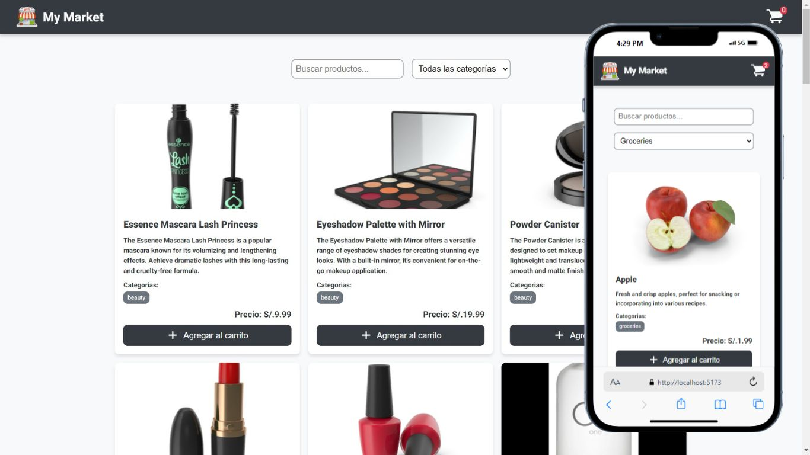

# Fase 2: JavaScript

En esta segunda fase del proyecto My Market, el enfoque está en agregar la lógica interactiva y dinámica a la aplicación. Utilizamos JavaScript para interactuar con el DOM, consumir una API externa y manejar eventos que mejoran la experiencia del usuario.

<br>

<div align= "center">
  
</div>


## Objetivos de esta Fase

   - Crear la lógica de interacción dinámica con los productos.
   - Consumir datos de productos y categorías desde una API externa.
   - Implementar un sistema de filtrado por nombre y categorías.
   - Crear la funcionalidad de carrito de compras y contar productos agregados.

## Funcionalidades Implementadas

   1. Obtención de Productos desde la API:

      - Se realiza una llamada a la API de DummyJSON para obtener los productos y categorías.
      - Los productos se renderizan dinámicamente en la página.

   2. Filtrado de Productos:

      - Se implementa un sistema de búsqueda que permite filtrar productos por nombre y categoría.
      - Los resultados se actualizan en tiempo real a medida que el usuario interactúa con los filtros.

   3. Carrito de Compras:

      - Se crea la funcionalidad de carrito de compras que permite a los usuarios agregar productos.
      - El contador de productos en el carrito se actualiza dinámicamente al agregar o quitar artículos.

   4. Eventos Dinámicos:

      - Se manejan eventos como clicks en los botones de agregar al carrito y cambios en los filtros de búsqueda para ofrecer una experiencia interactiva.

## Tecnologías Utilizadas

- **JavaScript ES6+**: Para la lógica interactiva y consumo de la API.
- **Fetch API**: Para realizar las llamadas a la API externa y obtener datos en formato JSON.
- **Vite**: Se utiliza Vite como builder para optimizar el proyecto y facilitar el desarrollo con recarga automática y soporte para módulos ES.
- **HTML5**: Para estructurar el contenido.
- **CSS3**: Para los estilos, que ya fueron establecidos en la fase anterior.

## Decisiones Técnicas

- Se ha optado por utilizar fetch para las solicitudes HTTP por su simplicidad y soporte nativo en navegadores modernos.
- Se ha implementado una estructura modular de funciones para hacer que el código sea más fácil de mantener y escalar.
- Se comenzó a aplicar principios de separación de responsabilidades, dividiendo la lógica de la interfaz (renderizado) y la lógica de manejo de datos.

## Arquitectura de Carpetas

El proyecto ha sido estructurado de manera clara y modular, especialmente al utilizar Vite como builder para facilitar el desarrollo y optimizar el proceso de construcción final del proyecto. A continuación se detalla la organización:


### Descripción de la estructura

- **assets/**: Almacena todos los recursos estáticos, como imágenes e íconos, organizados para facilitar el acceso y reutilización en el proyecto.

- **css/**: Contiene los estilos del proyecto, organizados en módulos independientes para cada sección o componente, lo que permite un mantenimiento más sencillo y escalable. Además, se incluye un archivo global para definir variables comunes como colores, fuentes y tamaños.

- **js/**: Almacena los archivos JavaScript que gestionan tanto la interacción con la API como la manipulación dinámica del DOM. También contiene un archivo específico con funciones utilitarias, que centralizan la lógica reutilizable del proyecto.

- **html/**: Contiene fragmentos principales de HTML que son insertados dinámicamente en el `index.html` utilizando JavaScript, permitiendo la modularización y reutilización de estructuras comunes en la aplicación.


## Levantar el Proyecto

Para visualizar el proyecto en esta fase de **JavaScript** usando **Vite**, sigue estos pasos:

1. **Clonar el repositorio**: 
   
   ```bash
      git clone https://github.com/tu-usuario/BC56-FRONTEND-REACT-NTT.git
   ```
2. **Navegar a la carpeta del proyecto**:

   ```bash
      cd BC56-FRONTEND-REACT-NTT
   ```
3. **Instalar dependencias** (Vite necesita dependencias minimas):

   ```bash
      npm install
   ```
4. **Correr el proyecto** con Vite:

   ```bash
      npm run dev
   ```
3. **Abrir el proyecto** 

    Acceder a la URL proporcionada por Vite (generalmente http://localhost:5173).

