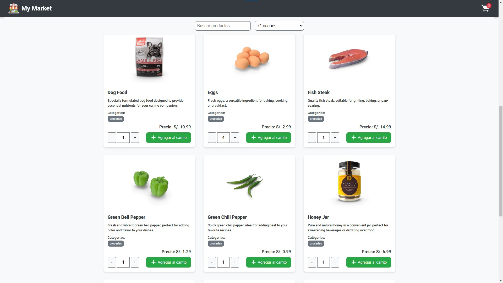
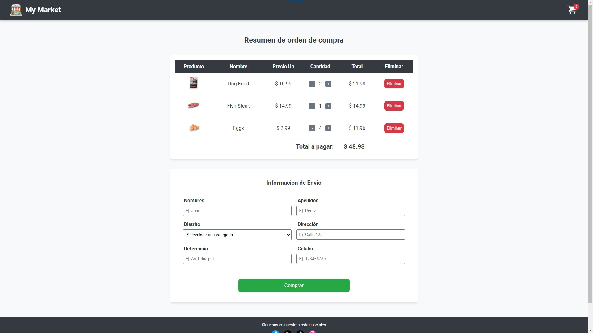
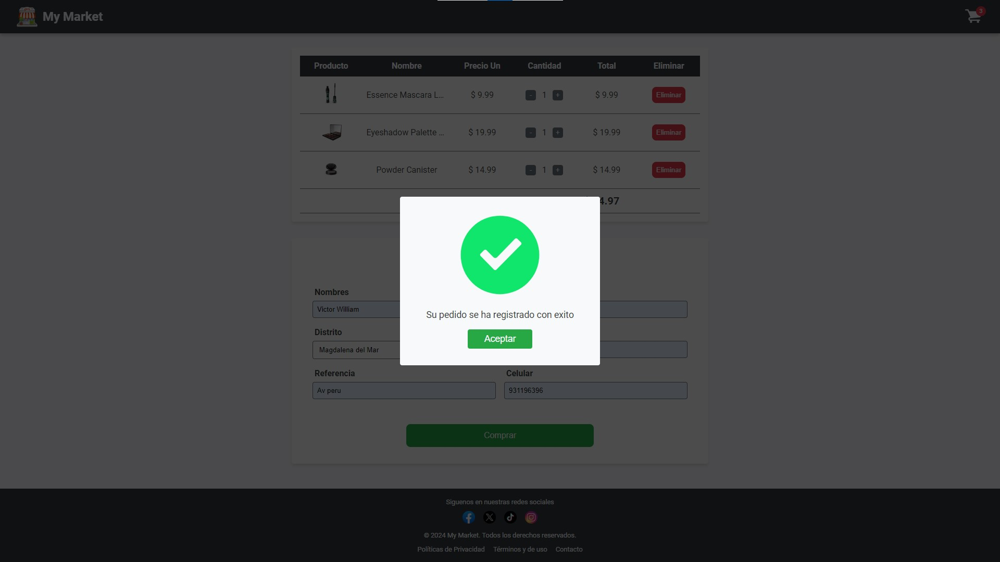

# Fase 5: React Implementación
<p align=center>



</p>

En esta fase, se ha completado la implementación de la lógica de negocio y la funcionalidad total de la aplicación utilizando el hook `useReducer` de React para un manejo más avanzado del estado global. Además, se ha desarrollado un enrutador personalizado que permite la navegación entre las dos vistas principales del proyecto: **Market** y **Resumen**. Hasta el momento no se ha usado ninguna dependencia externa a **React** para implementar alguna funcionalidad del proyecto.

## Cambios Realizados

- **Manejo Avanzado del Estado**: Se ha implementado `useReducer` para gestionar el estado global de la aplicación, lo que permite un control más preciso sobre las acciones y actualizaciones de estado.

- **Enrutador Personalizado**: Se ha creado un enrutador básico que facilita la navegación entre las dos vistas principales del proyecto: la vista **Market**, donde los usuarios pueden explorar productos, y la vista **Resumen**, donde se muestran los detalles del carrito de compras.

- **Funcionalidad del Carrito de Compras**: Se ha mejorado el carrito, permitiendo a los usuarios seleccionar la cantidad de productos que desean agregar, así como actualizar o eliminar productos del carrito de manera dinámica.

- **Formulario de Confirmación de Compra**: Se ha añadido un formulario que permite a los usuarios ingresar sus datos personales antes de confirmar la orden de compra, mejorando la funcionalidad del proceso de compra.

- **Ajustes en la Vista Market**: Se han realizado mejoras en la vista de **Market**, incluyendo la posibilidad de seleccionar la cantidad de productos que se desea agregar al carrito para cada producto específico, así como diversas mejoras en los estilos y la usabilidad general.

Estos cambios permiten una experiencia de usuario más completa, con un flujo de compra dinámico y un manejo eficiente del estado de la aplicación.


## Probar proyecto localmente

Requisito: Tener instalado Node.js v20 LTS

1. **Clonar el repositorio**:

   ```bash
   git clone https://github.com/tu-usuario/BC56-FRONTEND-REACT-NTT.git

   ```

2. **Navegar a la carpeta del proyecto**:

   ```bash
   cd BC56-FRONTEND-REACT-NTT
   ```

3. **Cambiar de Rama**:

   ```bash
   git checkout feature/react-implementation
   ```

4. **Instalar dependencias** (Vite necesita dependencias mínimas):
   ```bash
   npm install
   ```

5. **Correr el proyecto** con Vite:

   ```bash
   npm run dev
   ```

6. **Abrir el proyecto**

   Acceder a la URL proporcionada por Vite (generalmente http://localhost:5173).

## Estructura de Carpetas:

La estructura del proyecto sigue sido organizada para optimizar el desarrollo con React y TypeScript, siguiendo buenas prácticas de separación de responsabilidades, a comparacion de la fase anterior se agregaron nuevas carpetas:

- `src/components/`: Contiene todos los componentes visuales reutilizables a nivel global de la aplicación.
- `src/context/`: Maneja el estado global de la aplicación.
- `src/css/`: Archivos CSS globales que aplican a toda la aplicación.
- `src/data/`: Contiene archivos de datos estáticos o estructuras predefinidas usadas en la aplicación, en este caso un array con los Distritos de Lima.
- `src/helpers/`: Funciones auxiliares que simplifican la lógica y tareas comunes del proyecto.
- `src/hooks/`: Contiene hooks personalizados para manejar lógica reutilizable en diferentes componentes.
- `src/mappers/`: Implementa el patrón Mapper para transformar datos entre la API y la lógica interna.
- `src/pages/`: Contiene las diferentes páginas de la aplicación, organizadas por módulos.
  - `src/pages/.../components/`: Componentes específicos de cada página.
  - `src/pages/.../css/`: Estilos CSS específicos de cada página.
- `src/router/`: Maneja la lógica de enrutamiento del proyecto, permitiendo la navegación entre diferentes vistas.
- `src/services/`: La lógica que interactúa con APIs y servicios externos.
- `src/types/`: Define las estructuras y tipos usados en la aplicación.
- `src/utils/`: Funciones de utilidad que facilitan tareas comunes en el proyecto.
- `src/validations/`: Contiene la lógica para validación de formularios y entradas de usuario.
