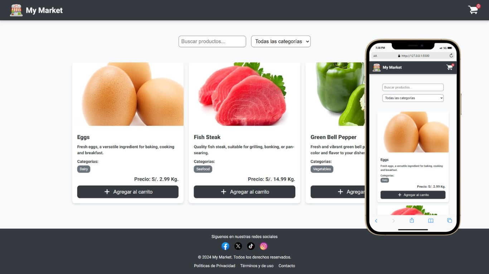

# Fase 1: Diseño y Estilos

Esta primera fase de mi proyecto **My Market**, esta enfocado en la creación del diseño y la estructura visual básica de la aplicación. Se utiliza **CSS** como principal herramienta para dar estilo a los elementos HTML y asegurar una experiencia visual atractiva y coherente.

<br>

<div style="text-align: center;">
  
</div>


## Objetivos de esta Fase

- Crear la estructura del diseño con HTML y CSS.
- Asegurar que la aplicación sea responsive y funcione bien en diferentes tamaños de pantalla.
- Establecer una paleta de colores y tipografías consistentes.
- Implementar el diseño del header, footer y sección de productos de la tienda.

## Componentes Estilizados

1. **Header:**

   - Se diseñó un header fijo con el logo y el carrito de compras, que es accesible desde cualquier parte de la página.

2. **Formulario de Búsqueda:**

   - Incluye un campo de texto y un selector de categorías estilizados.
   - Los inputs tienen bordes redondeados y un estilo claro para mejorar la usabilidad.

3. **Sección de Productos:**

   - Los productos se muestran en un grid flexible que se adapta a diferentes resoluciones.
   - Cada producto incluye una imagen, descripción, categorías, precio y botón de acción.

4. **Footer:**
   - Se incluye un footer con enlaces a redes sociales y links legales.
   - El diseño del footer es simple pero efectivo, manteniendo la coherencia visual con el resto de la página.

## Tecnologías Utilizadas

- **CSS3**: Para la creación de estilos.
- **HTML5**: Para estructurar el contenido.
- **SVG**: Para los íconos.
- **Flexbox**: Para la disposición de los elementos.

## Decisiones Técnicas

- Se ha optado por el uso de **Flexbox** en lugar de floats para el layout, ya que ofrecen una mayor flexibilidad y adaptabilidad a diferentes tamaños de pantalla y reduce la cantidad de media queries necesarias.
- Se utilizan variables CSS para mantener consistencia en los colores y otros valores repetidos a lo largo de la hoja de estilos.

## Arquitectura de Carpetas

El proyecto está organizado de una manera que facilita la mantenibilidad, la escalabilidad y la claridad del código. A continuación se describen las consideraciones detrás de la organización de cada carpeta y archivo:


### Descripción de la estructura

- **assets/**: Se ha separado esta carpeta para almacenar todos los recursos estáticos como imágenes e íconos. Esta organización permite centralizar y gestionar eficientemente los archivos de medios, manteniendo el código limpio y ordenado.
  
- **css/**: El diseño de estilos ha sido modularizado para facilitar el mantenimiento y escalabilidad de los estilos de la aplicación. Cada parte importante de la interfaz (header, main, footer) tiene su propio archivo CSS, lo que permite realizar modificaciones específicas sin afectar otras secciones. También se incluye un archivo `reset.css` para estandarizar los estilos entre navegadores y un `style.css` que agrupa los estilos generales y globales.

- **js/**: Aquí se alojarán los archivos JavaScript o TypeScript conforme el proyecto evolucione. Mantener el código separado en esta carpeta permite una fácil identificación de los scripts y facilita la transición a TypeScript en futuras fases.

- **index.html**: La página principal del proyecto donde se integran todos los estilos y scripts. Representa el punto de entrada de la aplicación y contiene la estructura HTML básica.

- **README.md**: Este archivo documenta el proyecto, explicando su propósito, características y cómo configurarlo.

- **LICENSE**: Archivo de licencia que especifica los derechos y restricciones asociados con el uso y distribución del código del proyecto.

### Consideraciones

La estructura se basa en las siguientes premisas:

1. **Modularidad**: Separar los archivos según sus responsabilidades facilita el trabajo en equipo y las futuras ampliaciones del proyecto.
2. **Escalabilidad**: A medida que el proyecto crezca y se incorporen más estilos, scripts o recursos, la estructura modular permitirá mantener el código organizado sin volverse inmanejable.
3. **Claridad**: Cada carpeta y archivo tiene un propósito claro y está nombrado de manera descriptiva para que cualquier desarrollador pueda entender la estructura rápidamente.


```bash
BC56-FRONTEND-REACT-NTT/      # Carpeta raiz del proyecto
│
├── assets/                     # Recursos estáticos (imágenes, íconos)
│   ├── images/
│   └── icons/
│
├── css/                        # Archivos de estilos
│   ├── reset.css                 # Reset de estilos globales
│   ├── style.css                 # Estilos principales
│   ├── header.css                # Estilos del header
│   ├── main.css                  # Estilos de main
│   └── footer.css                # Estilos de footer
│
├── js/                         # Archivos de JavaScript
│
├── index.html                  # Pagina principal del proyecto
├── README.md                   # Documentación principal del proyecto
└── LICENSE                     # Archivo de licencia

```

## Levantar el Proyecto

Para visualizar el proyecto en esta etapa de **Diseño y Estilos**, sigue estos pasos sencillos:

1. **Clonar el repositorio**: 
   
   ```bash
      git clone https://github.com/tu-usuario/BC56-FRONTEND-REACT-NTT.git
   ```
2. **Navegar a la carpeta del proyecto**

   ```bash
      cd BC56-FRONTEND-REACT-NTT
   ```
3. **Abrir el archivo** `index.html`

   - Método 1: Arrastra el archivo `index.html` desde el explorador de archivos a tu navegador favorito.
   - Método 2: Si prefieres trabajar con un entorno local, puedes iniciar un servidor local utilizando extensiones como Live Server en VS Code.