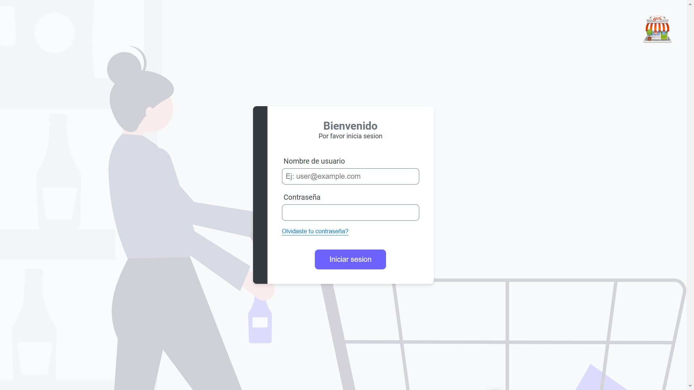
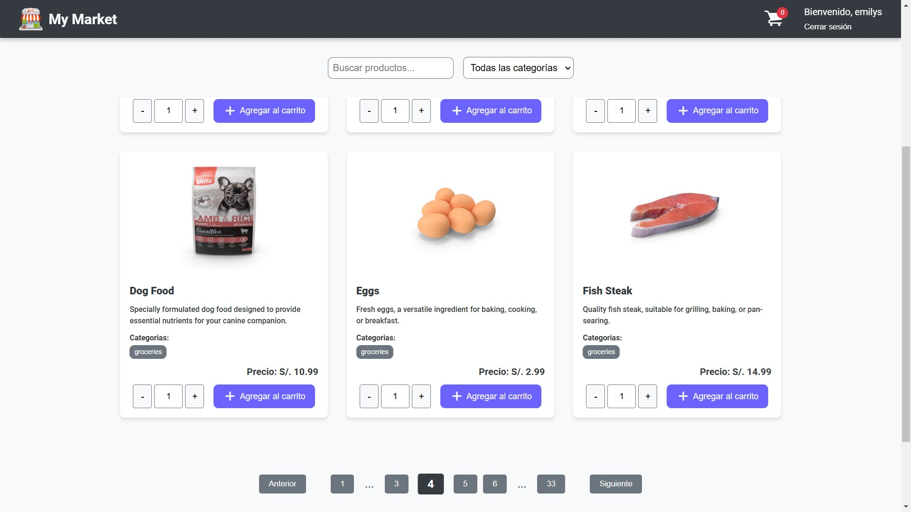
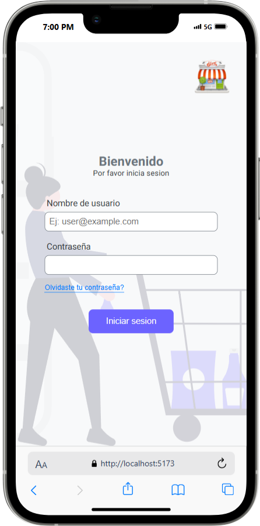

# Fase Final: Proyecto Integrador

<p align=center>



</p>

En esta fase final del bootcamp, se ha completado el desarrollo de la aplicación “My Market” con la implementación de todas las funcionalidades principales.

## Cambios Realizados

- **Manejo Completo del Estado Global**: Se consolidó `useReducer` junto con `useContext` para el manejo centralizado del estado, permitiendo actualizaciones de datos y control avanzado sobre el flujo de la aplicación, especialmente en la gestión del carrito de compras y el sistema de paginación.

- **Autenticación de Usuario**: Se implementó la autenticación con tokens y el sistema de actualización automática de estos, con manejo de errores en caso de que el usuario necesite iniciar sesión nuevamente. Esto mejora la seguridad de la aplicación y mantiene la sesión activa sin interrupciones.

- **Filtro de Productos y Paginación**: Se optimizaron los filtros de productos por categoría y búsqueda, permitiendo a los usuarios explorar y filtrar productos de forma intuitiva. Además, se implementó paginación dinámica para facilitar la navegación.

- **Resumen y Confirmación de Compra**: En la vista de Resumen, los usuarios pueden revisar y modificar el carrito antes de confirmar la compra. El proceso de confirmación permite agregar datos personales, garantizando una experiencia de compra completa y funcional.

- **Cobertura de Pruebas**: La aplicación incluye pruebas unitarias que abarcan todos los componentes y hooks principales, utilizando Vitest y React Testing Library.


## Probar proyecto localmente

Requisito: Tener instalado Node.js v20 LTS

1. **Clonar el repositorio**:

   ```bash
   git clone https://github.com/victorwcv/BC56-FRONTEND-REACT-NTT.git

   ```

2. **Navegar a la carpeta del proyecto**:

   ```bash
   cd BC56-FRONTEND-REACT-NTT
   ```

3. **Cambiar de Rama**:

   ```bash
   git checkout feature/integrative-project
   ```

4. **Instalar dependencias** (Vite necesita dependencias mínimas):
   ```bash
   npm install
   ```

5. **Correr el proyecto** con Vite:

   ```bash
   npm run dev
   ```

6. **Abrir el proyecto**

   Acceder a la URL proporcionada por Vite (generalmente http://localhost:5173).
