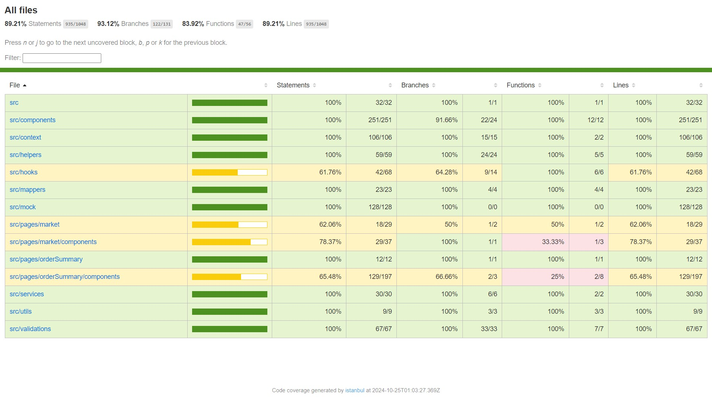

# Fase 6: Pruebas Unitarias

## Coverage:

<p align=center>

</p>

## Descripción
En esta fase del proyecto, se implementarán pruebas unitarias para garantizar el correcto funcionamiento de los componentes y la lógica de la aplicación. Se a utilizado **Vitest** como framework de pruebas ya que esta mejor integrado en el ecosistema de **Vite** y **React Testing Library** para pruebas de componentes React.

## Estructura de Pruebas
Las pruebas se organizarán en archivos `.test.tsx` o `.test.ts` que acompañarán a los componentes y funciones a testear. Cada prueba cubrirá un caso de uso específico para garantizar que las funciones y componentes se comporten según lo esperado.

## Herramientas Utilizadas
- **Vitest**: Framework de pruebas rápido y compatible con TypeScript.
- **React Testing Library**: Herramienta para pruebas de componentes React basada en la interacción del usuario.

## Realizar los tests

Requisito: Tener instalado Node.js v20 LTS

1. **Clonar el repositorio**:

   ```bash
   git clone https://github.com/victorwcv/BC56-FRONTEND-REACT-NTT.git

   ```

2. **Navegar a la carpeta del proyecto**:

   ```bash
   cd BC56-FRONTEND-REACT-NTT
   ```

3. **Cambiar de Rama**:

   ```bash
   git checkout feature/react-implementation
   ```

4. **Instalar dependencias**:
   ```bash
   npm install
   ```

5. **Ejecutar en la terminal** 

- Para ejecutar las pruebas, usa el siguiente comando:
   ```bash
   npm run test
   ```
- Para obtener el reporte de cobertura (coverage):
   ```bash
   npm run test:coverage
   ```

## Resultados

Hasta el momento, se ha logrado alcanzar un nivel de cobertura de código cercano al **90%**. Esto refleja un esfuerzo considerable por asegurar que las funcionalidades clave de la aplicación están correctamente probadas y cubiertas por casos de prueba que verifican tanto el comportamiento esperado como las posibles situaciones límite.

El objetivo final es alcanzar una cobertura lo más cercana posible al **100%**, asegurando con ello que la aplicación no solo es funcional, sino también robusta y confiable.


